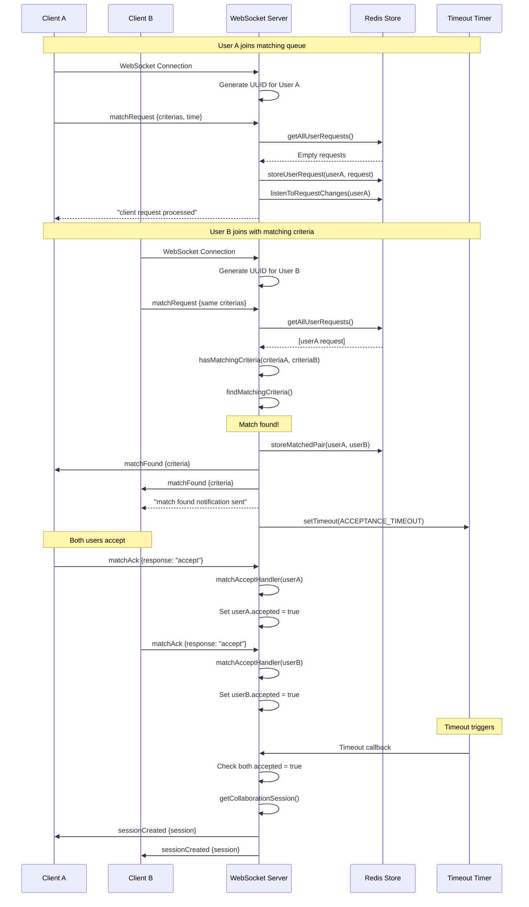
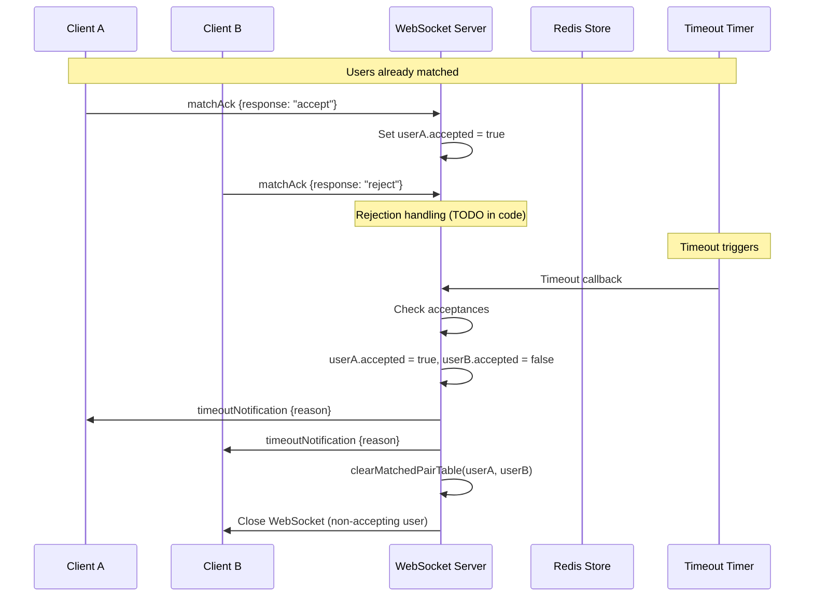
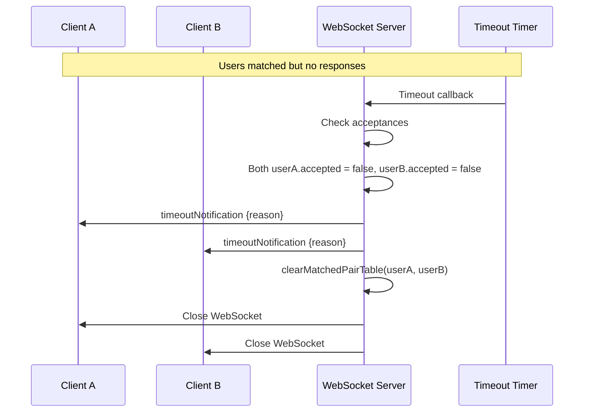
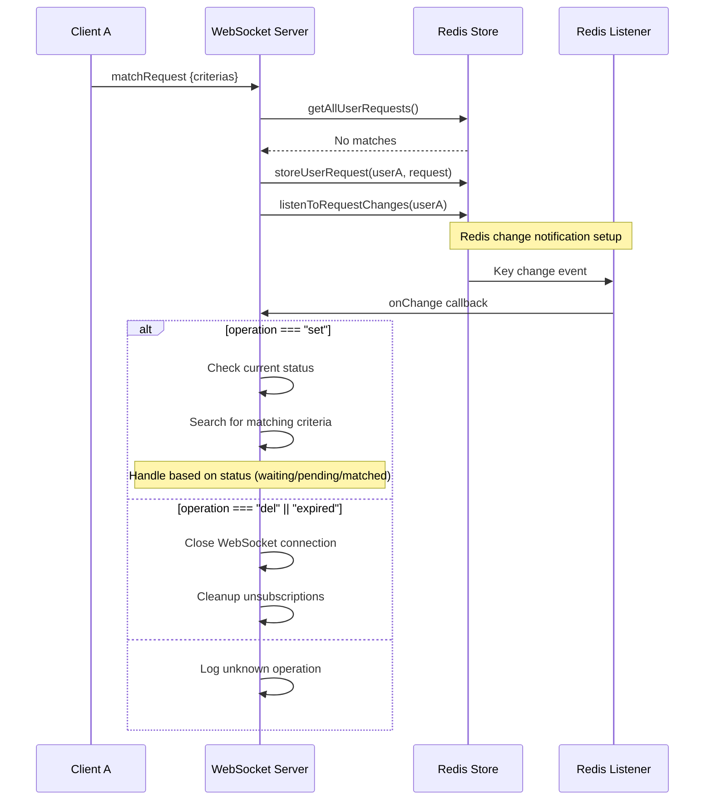
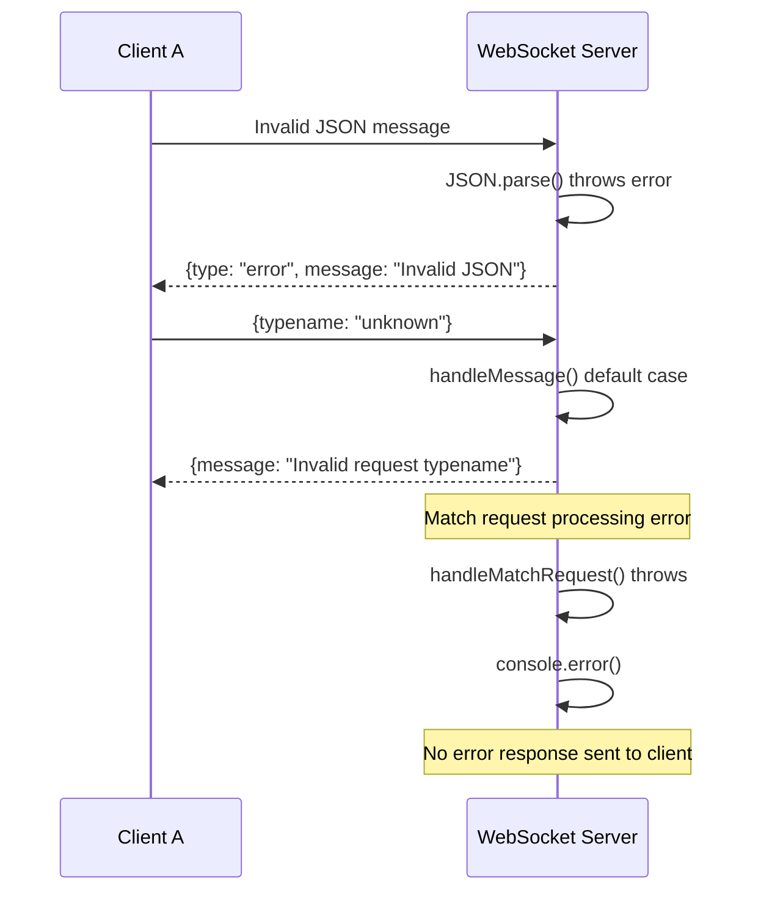

# Matching Service Sequence Diagrams

This document contains sequence diagrams for the matching service WebSocket flow based on `server.js`.

## 1. Successful Match Flow



## 2. Match Rejection Flow



## 3. Timeout Flow (No Response)



## 4. Redis Change Notification Flow



## 5. Disconnection Flow

```memmaid
sequenceDiagram
    participant C1 as Client A
    participant WS as WebSocket Server
    participant Redis as Redis Store

    C1->>WS: WebSocket Close Event
    WS->>WS: handleDisconnect(userInstance)
    WS->>WS: userConnections.delete(userA.id)
    
    Note over WS: TODO: Cleanup logic
    Note over WS: Should remove from Redis
    Note over WS: Should cancel active matches
    Note over WS: Should notify partners
```

## 6. Error Handling Flow



## Message Types

### Client to Server Messages

```typescript
// Match Request
{
  typename: "matchRequest",
  criterias: [
    {
      difficulty: "easy" | "medium" | "hard",
      language: string,
      topic: string
    }
  ],
  time: number
}

// Match Acknowledgment
{
  typename: "matchAck", 
  response: "accept" | "reject"
}
```

### Server to Client Messages

```typescript
// Match Found Notification
{
  type: "matchFound",
  details: Criteria
}

// Session Created
{
  session: string // "Some random session"
}

// Timeout Notification
{
  reason: "one of the user never accepts within time limit"
}

// Processing Confirmations
{
  message: "client request processed" | "match found notification sent"
}

// Error Response
{
  type: "error",
  message: string,
  e: Error
}
```

## Redis Operations

### Key Patterns
- **User Requests**: `user_request:{userId}`
- **Matched Pairs**: `matched_pair:{userId1}:{userId2}`
- **Sessions**: `session:{sessionId}`

### Operations Flow
1. **Store Request**: `storeUserRequest(userId, request)`
2. **Get All Requests**: `getAllUserRequests()` 
3. **Store Match**: `storeMatchedPair(user1, user2)`
4. **Listen Changes**: `listenToRequestChanges(userId, callback)`

## Configuration

- **Port**: `process.env.PORT || 3001`
- **Timeout**: `process.env.ACCEPTANCE_TIMEOUT`
- **Redis**: Initialized via `initializeRedis()`

## Notes

- The server uses both in-memory maps and Redis for different purposes
- Change notifications are handled via Redis keyspace events
- Timeout handling uses JavaScript `setTimeout`
- Error handling could be improved (many operations don't send error responses)
- Disconnection cleanup is incomplete (marked as TODO)
- Match rejection logic is not fully implemented